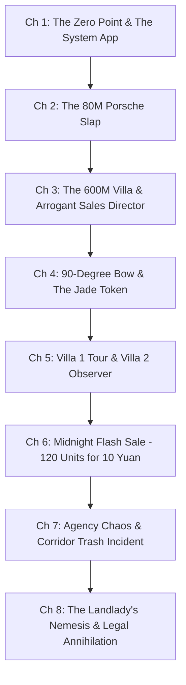

# CHAPTER MAP — EPISODE 1 BEAT-BY-BEAT BREAKDOWN

## ARCHITECTURAL BREAKDOWN

---

## CHAPTER-BY-CHAPTER BEAT SHEET

### Chapter 1: The Zero Point & The Trillion Subsidy
- **Narrative Hook**: The brutal reality of a young graduate in Shanghai—unemployed, landlord banging on the door demanding advance rent, 5,220 RMB left in bank.
- **Turning Point**: Discovery of the un-uninstallable "Trillion Subsidy" app.
- **Micro-Beats**:
  1. *Beat 1.1*: Landlady Zhao’s aggressive knocking outside the door ("Lin Fan! Open up!").
  2. *Beat 1.2*: Internal monologue on 2x electricity charges, impending company bankruptcy.
  3. *Beat 1.3*: Phone app appears. Inability to delete it.
  4. *Beat 1.4*: Newcomer flash deals screen: Porsche 911GT1-98 (0.1 RMB), Dongjiao No. 1 Villa (0.1 RMB).
  5. *Beat 1.5*: Accidental/Curious tap on Porsche. Instant bank debit of 0.1 RMB from Card 9528.
  6. *Beat 1.6*: Heavy cowhide key with golden Porsche shield drops into his pocket.
  7. *Beat 1.7*: Lin Fan instantly buys the 600M Villa for 0.1 RMB (30 min delivery).
  8. *Beat 1.8*: GPS tracker shows the Porsche waiting in the adjacent mall parking lot.

---

### Chapter 2: The World's Only Porsche
- **Narrative Hook**: A crowded underground parking lot where a Mercedes-Benz has rear-ended an ultra-rare hypercar.
- **Turning Point**: The arrogant crowd assumes Lin Fan is an interfering beggar until the butterfly doors rise.
- **Micro-Beats**:
  1. *Beat 2.1*: Lin Fan arrives at the mall underground lot, finds a packed crowd.
  2. *Beat 2.2*: Young Mercedes driver in white shirt trembling and crying: "It's an 80M Porsche 911GT1-98, 1 of 1 in the world!"
  3. *Beat 2.3*: Mercedes paint is stripped; Porsche rear bumper is completely unscathed.
  4. *Beat 2.4*: Lin Fan inspects his car calmly: "Brother, no need to pay."
  5. *Beat 2.5*: Crowd jeers and mocks Lin Fan's cheap clothes ("Mind your own business, kid!").
  6. *Beat 2.6*: Lin Fan clicks the key fob. Ambient LEDs flare; butterfly doors open vertically.
  7. *Beat 2.7*: Dead silence in the crowd. Face-slap payoff.
  8. *Beat 2.8*: Lin Fan climbs into the ergonomic bucket seat and speeds away.

---

### Chapter 3: The 600 Million Crown Villa
- **Narrative Hook**: The contrast between high-speed roaring supercars and corporate arrogance in prime real estate.
- **Turning Point**: Arrogant Sales Director Liao orders security to expel the client who just bought their flagship estate.
- **Micro-Beats**:
  1. *Beat 3.1*: Lin Fan pauses at The Bund; phone rings from sales agent Li Moyu.
  2. *Beat 3.2*: Dongjiao No. 1 Sales Office erupts: Manager Song Shuming issues red-alert VIP readiness.
  3. *Beat 3.3*: Lin Fan walks into the palatial sales showroom in plain casual wear.
  4. *Beat 3.4*: Sweet junior agent Xiaoli greets him courteously.
  5. *Beat 3.5*: Sales Director Liao Yingying intercepts viciously, insulting Lin Fan as a pauper.
  6. *Beat 3.6*: Lin Fan calmly dials Li Moyu on speaker: "Your sales director is telling me to get out."

---

### Chapter 4: The 90-Degree Bow
- **Narrative Hook**: The explosive confrontation between the showroom director and the branch manager.
- **Turning Point**: Song Shuming bows to Lin Fan; instant firing of Liao Yingying.
- **Micro-Beats**:
  1. *Beat 4.1*: Song Shuming storms downstairs, roars at Liao Yingying.
  2. *Beat 4.2*: Song executes a crisp 90-degree bow to Lin Fan: "Mr. Lin, please forgive our negligence! Call me Xiao Song."
  3. *Beat 4.3*: Total shockwave across the showroom staff.
  4. *Beat 4.4*: Liao Yingying collapses to her knees; Song summarily fires her on the spot.
  5. *Beat 4.5*: VIP Lounge tea ceremony; Li Moyu presents the red deed book and keys.
  6. *Beat 4.6*: Delivery of the Chairman's gratitude gift: Suet Jade Safety Buckle with maroon cinnabar veins.
  7. *Beat 4.7*: Song's internal conviction that Lin Fan is an ancient hidden family heir.

---

### Chapter 5: The Manor of Dongjiao
- **Narrative Hook**: Stepping into the pinnacle of aristocratic architectural luxury.
- **Turning Point**: Lin Fan discovers his bank balance is 5,200 RMB while standing in a 600M palace; neighboring heiress takes notice.
- **Micro-Beats**:
  1. *Beat 5.1*: Song escorts Lin Fan to garage, sees the 80M Porsche 911GT1-98, reverence quadruples.
  2. *Beat 5.2*: Lin Fan drives through Dongjiao No. 1 security checkpoint; guards salute.
  3. *Beat 5.3*: Exploration of Villa No. 1: 4 levels, private swimming pool, fountain courtyard, armored vault room, private wine cellar.
  4. *Beat 5.4*: Lin Fan's realization of extreme wealth vs cash shortage (needs real cash flow for daily life).
  5. *Beat 5.5*: POV shift to Villa No. 2: Elegant young heiress and Butler Sun Fu observe Villa No. 1's silent occupancy.
  6. *Beat 5.6*: Heiress respects the understated restraint, orders a 1990 Romanée-Conti wine prepared as a gift.

---

### Chapter 6: The Midnight 120-Suite Strike
- **Narrative Hook**: The midnight refresh of the Trillion Subsidy System.
- **Turning Point**: 120 apartments in Lin Fan's old community purchased for 10 RMB; 2 cardboard boxes of deeds thud into the living room.
- **Micro-Beats**:
  1. *Beat 6.1*: 11:59 PM countdown in the luxury villa.
  2. *Beat 6.2*: 00:00 AM Flash Deal appears: Building 1 (Units 1 & 2, 120 apartments) in Junyue Huating for 10 RMB (worth 480M RMB).
  3. *Beat 6.3*: Instant purchase. 15-minute delivery timer.
  4. *Beat 6.4*: Two massive courier boxes materialize with a dull thud on the marble floor.
  5. *Beat 6.5*: Lin Fan unboxes stacks of red property certificates, all printed with his name.
  6. *Beat 6.6*: Financial calculation: 14M–17.28M RMB annual rental cash flow.
  7. *Beat 6.7*: Morning drive to Lover's Real Estate Agency across from Junyue Huating.
  8. *Beat 6.8*: Junior agent Xiao Ke opens the boxes and goes into utter cardiac shock.

---

### Chapter 7: The Master of Junyue Huating
- **Narrative Hook**: The agency's desperate search for the phantom buyer of Building 1 ends in their own lobby.
- **Turning Point**: Lin Fan arrives at his old 17th-floor rental to find his personal life dumped on the dirty concrete.
- **Micro-Beats**:
  1. *Beat 7.1*: Manager Zhou Wancai rushes out, bowing 90 degrees ("Call me Xiao Zhou").
  2. *Beat 7.2*: Exclusive agency contract signed for 120 apartments (3,500 RMB/room baseline).
  3. *Beat 7.3*: Zhou spots the white Porsche outside; offers banquet lunch.
  4. *Beat 7.4*: Lin Fan declines to retrieve his personal belongings from Unit 1704.
  5. *Beat 7.5*: Zhou insists on carrying bags as an assistant.
  6. *Beat 7.6*: 17th floor elevator doors open: clothes, bedding, and shoes scattered across the dirty corridor.

---

### Chapter 8: The Landlady's Judgement Day
- **Narrative Hook**: Arrogant Landlady Zhao showing the apartment to stylish new tenant Miss Jiang after trashing Lin Fan's property.
- **Turning Point**: Zhou reveals Lin Fan owns the entire building (120 apartments); Zhao suffers a total mental collapse.
- **Micro-Beats**:
  1. *Beat 8.1*: Landlady Zhao gives a sales pitch to corporate tenant Miss Jiang for 3,700 RMB/mo.
  2. *Beat 8.2*: Lin Fan confronts Zhao regarding the 6 days left on the contract and destroyed property.
  3. *Beat 8.3*: Zhao mocks him aggressively: "I trashed your junk! What can a beggar like you do?"
  4. *Beat 8.4*: Manager Zhou enters, recognizes Zhao as a small 5-property client under exclusive contract.
  5. *Beat 8.5*: Zhao calls Lin Fan a deadbeat; Zhou erupts: "Shut up! Mr. Lin owns 2 whole buildings—120 suites worth 480 Million!"
  6. *Beat 8.6*: Complete psychological devastation of Zhao; Miss Jiang looks at Lin Fan with starry-eyed admiration.
  7. *Beat 8.7*: Lin Fan refuses all apologies: enforces breach penalties and promises full civil litigation for intentional property destruction.
  8. *Beat 8.8*: Grand finale cliffhanger: Lin Fan steps out as the undisputed sovereign landlord of Junyue Huating.
